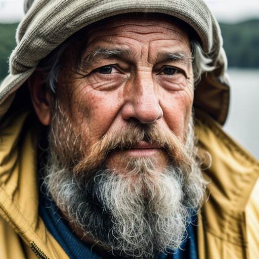
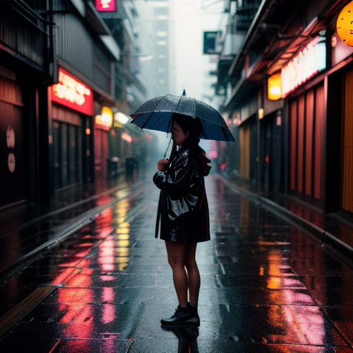
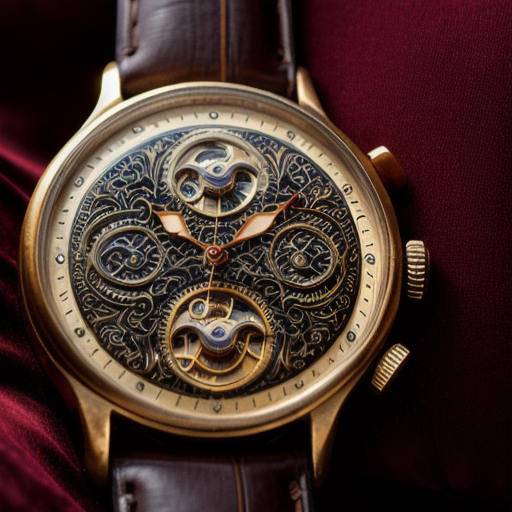

# Local Generative AI Implementation 🚀

This repository documents the local deployment, configuration, and optimization of Generative AI models (Stable Diffusion & Ollama) on consumer-grade hardware.

## 💻 System Specifications
* **OS:** Windows 11
* **Processor:** Ryzen 7 7445HS
* **RAM:** 16 GB DDR5
* **GPU:** NVIDIA RTX 3050 (6GB VRAM)

---

## 🎨 Project 1: Stable Diffusion (Image Generation)
**Goal:** Run SDXL and specialized SD1.5 checkpoints locally with optimized VRAM usage.

### Configuration
* **Interface:** Automatic1111
* **Arguments Used:** `--xformers` (Essential for 6GB VRAM efficiency)
* **Performance:** * Average Generation Time: 4-5 seconds (512x512, DPM++ 2M, 20 steps)
  * Peak VRAM Usage: 4.8 GB

---

## 🏆 High-Performance Showcase: Realistic Vision V5.1
To demonstrate the capabilities of the `Realistic_Vision_V5.1_fp16-no-ema` model, I ran several "stress tests" focusing on lighting, skin texture, and complex geometry.

### ⚙️ Implementation Notes for RV V5.1
* **Sampler:** `DPM++ 2M Karras` (Best balance of speed and photorealistic detail)
* **CFG Scale:** `5.0 - 7.0` (Higher values cause "deep fried" contrast; this range keeps skin tones natural)
* **Highres. fix:** Enabled
  * **Upscaler:** `ESRGAN_4x` or `R-ESRGAN 4x+`
  * **Upscale by:** `2x`
  * **Denoising strength:** `0.35 - 0.45` (Crucial for adding detail without changing the face)

### 🖼️ Sample Outputs

#### 1. Portrait Detail (Skin & Eyes)

> **Prompt:** A hyper-realistic close-up portrait of an elderly fisherman, weathered skin with deep wrinkles, salt-and-pepper beard, wearing a yellow raincoat, soft natural overcast lighting, shot on 85mm lens, f/1.8, 8k resolution, highly detailed skin texture, masterpiece, cinematic look.
>
> **Negative Prompt:** (deformed, distorted, disfigured:1.3), poorly drawn, bad anatomy, wrong anatomy, extra limb, missing limb, floating limbs, (mutated hands and fingers:1.4), disconnected limbs, mutation, mutated, ugly, disgusting, blurry, amputation, tattoo, makeup, plastic skin, smooth skin.

#### 2. Low-Light Atmosphere

> **Prompt:** Cinematic street photography, a woman standing in a neon-lit Tokyo alleyway during a rainstorm, reflections on wet pavement, depth of field, bokeh, vibrant colors against dark shadows, Fujifilm XT4, detailed raindrops on skin, intricate clothing texture.
>
> **Negative Prompt:** (worst quality, low quality:1.4), text, watermark, logo, banner, extra fingers, deformed hands, cartoon, illustration, painting, drawing, bad proportions.

#### 3. Interior & Lighting Geometry

> **Prompt:** Interior of a modern minimalist living room at sunset, large floor-to-ceiling windows, dust motes dancing in the light, high-end furniture, realistic shadows, architectural photography, photorealistic, volumetric lighting.
>
> **Negative Prompt:** (deformed, distorted:1.2), painting, sketch, drawing, lowres, text, cropped, oversaturated.

---

## 🤖 Project 2: Ollama (Local LLM)
**Goal:** Deploy a privacy-focused offline Chatbot.

### Setup Details
* **Engine:** Ollama
* **Models:**
  * **Daily Driver:** llama3.1 (8B)
  * **Coding:** qwen2.5-coder (7B)
  * **Reasoning:** deepseek-r1 (7B)
* **Latency:** Approx. 45-55 tokens/second (Model dependent)
